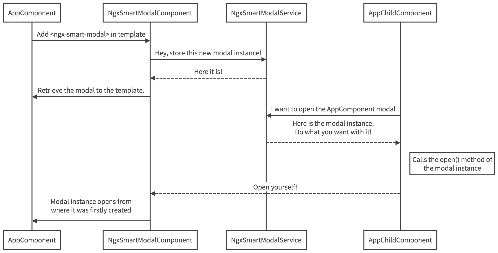

# ngx-smart-modal

[](https://gitter.im/ngx-smart-modal/Lobby?utm_source=badge&utm_medium=badge&utm_campaign=pr-badge&utm_content=badge)  [](https://badge.fury.io/js/ngx-smart-modal) [](https://npmjs.org/ngx-smart-modal) [](https://codecov.io/gh/maximelafarie/ngx-smart-modal)

ngx-smart-modal is a lightweight and very complete Angular library for managing modals inside any Angular project.

## No external library, pure Angular! 🤘

To avoid having to download a CSS library when using this package, simply use our built-in SCSS/CSS file with custom animations and overloadable variables. So you don't have to use a CSS library you don't want! What's more, it doesn't use jQuery either!

## CSS-framework-agnostic

Because we want to be as neutral as we can, we made it very flexible for you to style it with any CSS framework. So if your project uses a framework which is shipped with some modal styles, you simply have to pick up its class names and set the main class in the [customClass]="'modal'" (e.g.: bootstrap). And the rest of the modal DOM elements has just to be set into the ngx-smart-modal component (e.g.: `modal-dialog`, `modal-content`, `modal-header`, etc.).

## Features

* Handle large quantity of modals anywhere in your app
* Customize the style of your modals through custom CSS classes and SCSS variables!
* No external CSS library is used so you can easily override the modals default style
* Pass data to any modal and retrieve it very simply in the modal view (or anywhere else)
* Events on open, close, dismiss, escape and more for each modal
* Manage all your modal stack and data with very fast methods
* Smart z-index computation (no ugly glitches or problems with a modal inside another)
* A modal in a modal in a modal in a modal... I guess you got it!
* AoT compilation support

## How it works

Basically, imagine that the component is based on a service that stores any modals you create in order to let you pick them up and manage them anywhere in your app at any time.


## Browsers Support

| Chrome | Firefox | Edge | Safari | Opera |
| ------ | ------- | ---- | ------ | ----- |
| > 75   | > 60    | > 17 | > 5.1  | > 60  |

<sub>Based on [browserl.ist](https://browserl.ist/?q=+%3E+0.5%25%2C+last+2+versions%2C+Firefox+ESR%2C+not+dead%2C+not+IE+9-11)</sub>

## Installation

```sh
npm i ngx-smart-modal --save
```

## Which version should I use?

If your project uses a version of Angular lower than 14 (or non-Ivy), use version `<=7.4.1`. Otherwise, use the latest version `>=14.x`.

## How to use

### Import the module

Add NgxSmartModalModule (with .forRoot() or .forChild() depending if the module which you import the library into is the main module of your project or a nested module) and NgxSmartModalService to your project NgModule

```ts
import { NgModule } from '@angular/core';
import { BrowserModule } from '@angular/platform-browser';

import { AppRoutingModule } from './app-routing.module';
import { AppComponent } from './app.component';
import { NgxSmartModalModule } from 'ngx-smart-modal';

@NgModule({
  declarations: [
    AppComponent
  ],
  imports: [
    BrowserModule,
    AppRoutingModule,
    NgxSmartModalModule.forRoot()
  ],
  providers: [
  ],
  bootstrap: [AppComponent]
})
export class AppModule { }
```

### Import the styles

And import ngx-smart-modal.scss or ngx-smart-modal.css in a global style file (e.g. styles.scss or styles.css in classic Angular projects or any other scss/css file it imports). Example with styles.scss:

```scss
/* You can add global styles to this file, and also import other style files */
@import "~ngx-smart-modal/styles/ngx-smart-modal"
```

## Manipulate modals

### from the template

You can use modals directly in your component's template like this:

```html
<ngx-smart-modal #myModal identifier="myModal">
  <h1>Title</h1>
  <p>Some stuff...</p>

  <button (click)="myModal.close()">Close</button>
</ngx-smart-modal>
```

At this point, the modal instance is stored in the NgxSmartModalService. You can do absolutely what you want with it, anywhere in your app. For example, from a component :

```ts
import { Component } from '@angular/core';
import { NgxSmartModalService } from 'ngx-smart-modal';

@Component({
  // ...
})
export class AppComponent {
  constructor(public ngxSmartModalService: NgxSmartModalService) {
  }
}
```

Then in the AppComponent view you can open any modal with no need to be in the same view:

```html
<button (click)="ngxSmartModalService.getModal('myModal').open()">Open myModal</button>
```

### with class reference (since 7.2.0)

```ts
import { Component } from '@angular/core';

import { MyComponent } from 'xxxx';

import { NgxSmartModalService } from 'ngx-smart-modal';

@Component({
  // ...
})
export class AppComponent {
  // If Angular < 8
  // @ViewChild(TemplateRef) tpl: TemplateRef<any>;

  // If Angular >= 8
  @ViewChild(TemplateRef, { static: false }) tpl: TemplateRef<any>;

  constructor(private ngxSmartModalService: NgxSmartModalService, private vcr: ViewContainerRef) {
    // simple text content
    this.ngxSmartModalService.create('myModal1', 'content', vcr).open();

    // component
    this.ngxSmartModalService.create('myModal2', MyComponent, vcr).open();

    // or templateRef
    this.ngxSmartModalService.create('myModal3', this.tpl, vcr).open();
  }
}
```

## Manipulate data

You can associate data with any created modal. To do that, use the setModalData() from the `NgxSmartModalService`:

```ts
import { AfterViewInit, Component } from '@angular/core';
import { NgxSmartModalService } from 'ngx-smart-modal';

@Component({
  // ...
})
export class AppComponent implements AfterViewInit {
  constructor(public ngxSmartModalService: NgxSmartModalService) {
  }

  ngAfterViewInit() {
    const obj: Object = {
      prop1: 'test',
      prop2: true,
      prop3: [{a: 'a', b: 'b'}, {c: 'c', d: 'd'}],
      prop4: 327652175423
    };

    this.ngxSmartModalService.setModalData(obj, 'myModal');
  }
}
```

After that, you can retrieve the modal data directly from the view with the getData() modal property. To avoid any errors with unavailable data, you can use the hasData() modal property (It's dynamic. If data comes after a certain time its value will automatically change to true):

```ts
<ngx-smart-modal #myModal identifier="myModal">
  <div *ngIf="myModal.hasData()">
    <pre>{{ myModal.getData() | json }}</pre>
  </div>

  <button (click)="myModal.close()">Close</button>
</ngx-smart-modal>
```

## Handle events

`ngx-smart-modal` comes with several built-in events:

* `onOpen`: modal is opening
* `onOpenFinished`: modal has been opened
* `onClose`: modal is closing
* `onCloseFinished`: modal has been closed
* `onDismiss`: modal is closing by clicking on its backdrop
* `onDismissFinished`: modal has been closed by clicking on its backdrop
* `onEscape`: modal has been closed by escape key
* `onAnyCloseEvent`: modal is closing whatever the kind of event (close / escape / dismiss)
* `onAnyCloseEventFinished`: modal has been closed whatever the kind of event (close / escape / dismiss)
* `visibleChange`: modal visibility has changed (regardless of the modal visibility state)
* `onDataAdded`: data were added to the modal (using `setData()`)
* `onDataRemoved` data were removed from the modal (using `removeData()`)

You can handle events directly from the view...

```html
<ngx-smart-modal #myModal identifier="myModal" (onOpen)="log('Modal opened!')" (onClose)="log('Modal closed!')" (onDismiss)="log('Modal dismissed!')">
  <h1>Title</h1>
  <p>Some stuff...</p>

  <button (click)="myModal.close()">Close</button>
</ngx-smart-modal>
```

...and execute component's functions:

```ts
@Component({
  // ...
})
export class AppComponent {
  constructor() {
  }

  public log(msg: string) {
    console.log(msg);
  }
}
```

Or you can declare modal in any template (e.g.: the Rickroll demo modal)...

```html
<ngx-smart-modal #videoModal identifier="videoModal" customClass="medium-modal">
  <h1>Hey, I Rickrolled You!</h1>
  <iframe #rickroll width="1280" height="720"
          src="https://www.youtube.com/embed/dQw4w9WgXcQ?rel=0&autoplay=1&controls=0&showinfo=0&ecver=1&enablejsapi=1"
          frameborder="0" allowfullscreen></iframe>

  <button class="button -dark" (click)="videoModal.close()">Close</button>
</ngx-smart-modal>
```

... and listen to its events from any component:

```ts
export class AppComponent implements AfterViewInit {
  // ...
  constructor(public ngxSmartModalService: NgxSmartModalService) {
  }

  ngAfterViewInit() {
    this.ngxSmartModalService.getModal('videoModal').onOpen.subscribe((modal: NgxSmartModalComponent) => {
      console.log('Rickroll modal opened!', modal);
    });
  }
}
```

## Parameters (`INgxSmartModalOptions`)

`ngx-smart-modal` comes with some parameters / options in order to make it fit your needs. The following parameters / options needs to be used like this: `<ngx-smart-modal [parameter-or-option-name]="value"></ngx-smart-modal>`

The below documentation will use the following pattern:
> `parameter/option name` (type) | default value | required? ― _description_

* `closable` (boolean) | `true` ― _Show / hide the cross icon at the top right corner of the modal_

* `escapable` (boolean) | `true` ― _Enable / disable the modal for listening to the escape keypress event (if pressed and this option is set to true, it will close the current opened modal or the latest opened if you have several modals opened at the same time)_

* `dismissable` (boolean) | `true` ― _Enable / disable the modal backdrop for listening to the click event (if backdrop is clicked and this option is set to true, it will close the current opened modal or the latest opened if you have several modals opened at the same time)_

* `identifier` (string) | `undefined` | **REQUIRED** ― _The identifiant of the modal instance. Retrieve a modal easily by its identifier_

* `force` (boolean) | true ― _If true and if you declare another modal instance with the same identifier that another, the service will override it by the new you declare in the modal stack_

* `customClass` (string) | `'nsm-dialog-animation-fade'` ― _All the additionnal classes you want to add to the modal (e.g.: any bootstrap modal class). You can add several classes by giving a string with space-separated class names_

* `backdrop` (boolean) | `true` ― _Enable / disable the backdrop of a modal. **Tip**: when you want to encapsulate several modals, set this options at true for the parent modal and false for the others_

* `hideDelay` (number) | `500` ― _Opening / closing class delay **in milliseconds**_

* `autostart` (boolean) | `false` ― _Define if the modal is showing up automatically when loaded or not_

* `target` (string) | `undefined` ― _Displays the modal relatively to the targeted element_

## API

`ngx-smart-modal` also comes with the `NgxSmartModalService` that you can use in any component like this:

```ts
import { Component } from '@angular/core';
import { NgxSmartModalService } from 'ngx-smart-modal';

@Component({
  // ...
})
export class AppComponent {
  constructor(public ngxSmartModalService: NgxSmartModalService) {
  }
}
```

**List of available methods**:

* `create(id: string, content: string or Component or TemplateRef, vcr: a ViewContainerRef reference, options: INgxSmartModalOptions)`: create a new modal and return the modal instance
* `addModal(modalInstance: ModalInstance, force?: boolean)`: add a new modal instance
* `getModal(id: string)`: retrieve a modal instance by its identifier
* `get(id: string)`: retrieve a modal instance by its identifier (alias of `getModal`)
* `open(id: string, force?: boolean)`: open a given modal
* `close(id: string)`: close a given modal
* `toggle(id: string, force?: boolean)`: toggle a given modal
* `getModalStack()`: retrieve all the created modals
* `getOpenedModals()`: retrieve all the opened modals
* `getHigherIndex()`: get the higher `z-index` value between all the modal instances
* `getModalStackCount()`: it gives the number of modal instances
* `removeModal(id: string)`: remove a modal instance from the modal stack
* `setModalData(data: any, id: string, force?: boolean)`: associate data to an identified modal
* `getModalData(id: string)`: retrieve modal data by its identifier
* `resetModalData(id: string)`: reset the data attached to a given modal
* `closeLatestModal()`: Close the latest opened modal **if it has been declared as escapable**

## Style & customization

`ngx-smart-modal` provides built-in [SCSS variables](https://sass-lang.com/guide#topic-2) that you can override easily like it (assuming you imported `ngx-smart-modal.scss` as explained above):

```scss
/* You can add global styles to this file, and also import other style files */
/* NgxSmartModal variables override */
$color-overlay: rgba(0, 0, 0, .7);
$dialog-position-top: 20%;

@import "~ngx-smart-modal/ngx-smart-modal";
// ...
```

_Note that variables needs to be overridden **before** `@import`!_

### Available SCSS variables

The below documentation will use the following pattern:
> `parameter/option name` (type) | default value | _description_

* `$color-overlay` (hex / rgb / rgba) | `rgba(0, 0, 0, .5)` ― _Modifies the modals overlay background color_

* `$dialog-position-top` (px / %) | `1.75rem` ― _Defines the position of the modal from the top of the screen_
* `$dialog-position-right` (px / %) | `1.75rem` ― _Defines the position of the modal from the right of the screen_
* `$dialog-position-bottom` (px / %) | `1.75rem` ― _Defines the position of the modal from the bottom of the screen_
* `$dialog-position-left` (px / %) | `1.75rem` ― _Defines the position of the modal from the left of the screen_

* `$transition-duration` (duration) | `500ms` ― _Defines the transition effect duration. **Keep in mind you also need to set the same time (in ms) in the `hideDelay` modal option (see below)**_

* `$transition-timing-function` (transition-timing-function Property) | `ease-in-out` ― _Specifies the speed curve of the transition effect ([available speed curves here](https://www.w3schools.com/cssref/css3_pr_transition-timing-function.asp))_

### Built-in effects

`ngx-smart-modal` can understand several built-in classes to open differently with a sexy effect:

To change this effect, you can use the `customClass` option (see below) but you also can define your own class names with dedicated effect and pass them to `customClass`!

* ``: no class. The modal will show without any transition effect
* `.nsm-dialog-animation-fade`: default modal effect with a simple fade effect
* `.nsm-dialog-animation-ltr`: the modal comes with a left-to-right effect
* `.nsm-dialog-animation-rtl`: the modal comes with a right-to-left effect
* `.nsm-dialog-animation-ttb`: the modal comes with a top-to-bottom effect
* `.nsm-dialog-animation-btt`: the modal comes with a bottom-to-top effect
* `.nsm-centered`: the modal is centered vertically

## Contributors

Many thanks to our [awesome contributors](https://github.com/maximelafarie/ngx-smart-modal/graphs/contributors)! ♥️ Still not on the list? Let's [contribute](https://github.com/maximelafarie/ngx-smart-modal/issues)!
